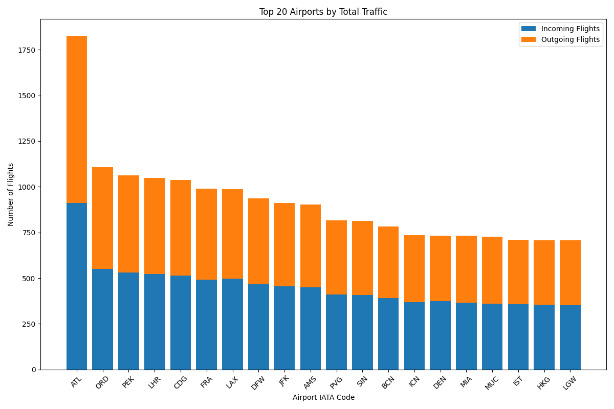
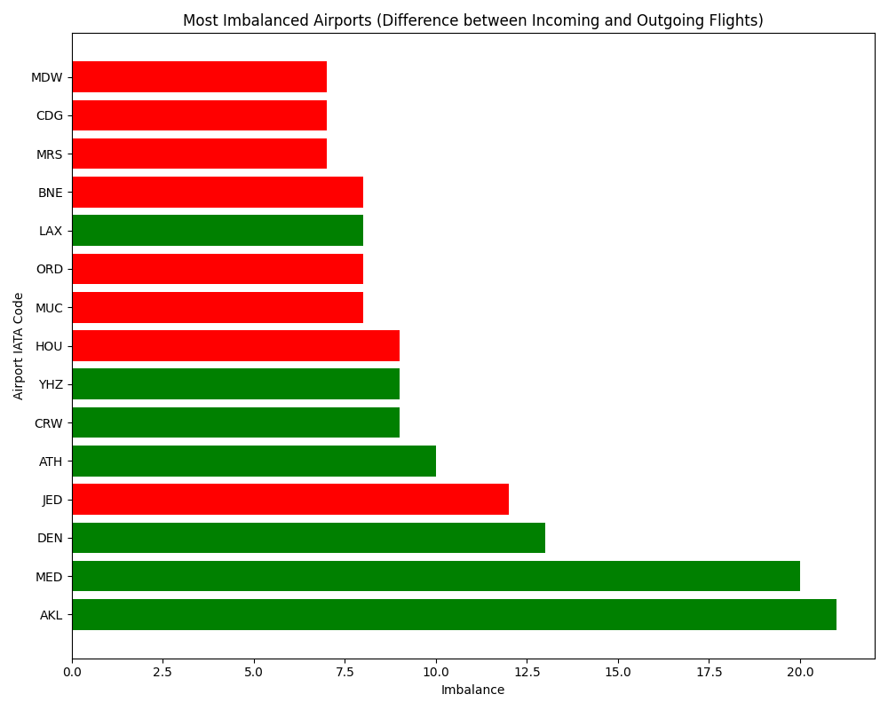

# ✈️ Global Flight Route Network Analysis

##  Overview

This project explores worldwide airline route data with a focused analysis on **Edinburgh Airport (EDI)**.
Using both **Python** and **Tableau**, the goal is to understand:

- Where passengers fly from Edinburgh
- Which airlines dominate this market
- Which airports are underserved
<!-- How route networks compare between Edinburgh and other major hubs like **London** -->

The insights are presented using **interactive Tableau dashboards** and **Python-based data analysis** with visualizations.

---

## 🎯 Objectives

- Visualize global routes from Edinburgh Airport
- Identify:
  - ✅ Top and bottom destination cities
  - ✈️ Most active airlines from Edinburgh
  - 🚫 Underserved airports (with only outgoing routes)
  - ⚖️ Airports with imbalanced incoming/outgoing traffic
- Compare flight networks between **Edinburgh** and **London**

---

## 📊 Tableau Dashboard

Built in [Tableau Public](https://public.tableau.com/), the interactive dashboard includes:

- 🌍 **World map of routes** from Edinburgh
- 🔝 **Top 10 destinations**
- ⛔ **Least served cities**
- 🏢 **Airlines with the most destinations**
- 📌 **Destination countries**
- 🔄 Optional comparison with **London**

### 🔗 Dashboard Link:
[View Tableau Dashboard Here](#) *(insert your Tableau Public link here)*

### 📸 Dashboard Preview

---

## 🐍 Python Analysis

### 📁 Data Sources:
- `airports.dat` — Airport codes, locations, names
- `airlines.dat` — Airline names and status
- `routes.dat` — Raw route data between airports

### 🔧 Processing Steps:
- Clean and merge datasets
- Create `routes_clean.csv`
- Analyze total traffic per airport
- Detect airports with:
  - No incoming flights
  - Heavy traffic imbalance
- Save processed files as CSV and generate charts

---

### 📈 Visual Results

#### 🔝 Top 20 Airports by Traffic

#### ⚠️ Most Imbalanced Airports
> Airports with high outgoing but low incoming routes

---

## 📂 Project Files

| File | Description |
|------|-------------|
| `routes_clean.csv` | Cleaned dataset used in Tableau |
| `airport_traffic_analysis.csv` | Airport traffic summary |
| `underserved_airports.csv` | Airports with no incoming routes |
| `top_20_airports.png` | Visualization of top airports |
| `imbalanced_airports.png` | Airports with route imbalances |
| `flight_analysis.ipynb` | Python notebook |
| Tableau Dashboard | Interactive visualization (see link above) |

---

## 🛠️ Tools & Technologies

- **Python 3** (Pandas, Matplotlib)
- **Tableau Public**
- **Jupyter Notebook**
- **CSV Data (OpenFlights.org)**

---

## 💡 Key Insights

- Low-cost carriers like **EasyJet** and **Ryanair** dominate Edinburgh's market
- Top destinations include **London**, **Paris**, and **Amsterdam**
- Some airports have **no return flights**, which may suggest:
  - Seasonal routes
  - Strategic flight planning gaps
- Route networks can differ significantly between **Edinburgh** and **London**

---

## 📌 Future Work

- Add **temporal data** (flight frequency, seasonality)
- Calculate **route distances** or durations
- Include **passenger volume or aircraft type**
- Build **country-to-country connection map**

---

## 👤 Author

**[Your Name]**  
- 🌐 [GitHub](https://github.com/yourusername)  
- 💼 [LinkedIn](https://www.linkedin.com/in/yourprofile)  
- 📧 [Your Email (optional)]

---

> Feel free to fork, clone, and contribute ideas or extensions!

